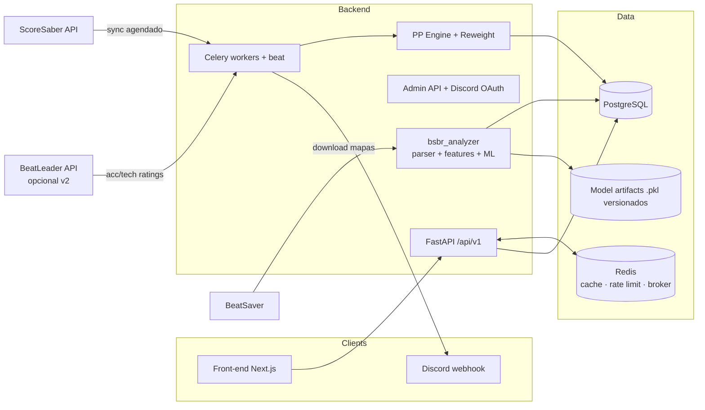

# BSBR v2 — Plano de Recriação

> Ranking brasileiro de Beat Saber, reconstruído com rating multi-componente (acc / tech / speed),
> pipeline semanal de ranqueamento com reweight, backend FastAPI + Redis + Postgres e front-end web moderno.
>
> Data: 2026-08-22 · Status: **em implementação** (ver §0 — status real em 2026-08-27)

---

## 0. Status de implementação (2026-08-27)

> Stack completa rodando via `docker compose up --build` (api :18000, web :3000, worker, beat,
> postgres :15432, redis :16379 neste host). 1319 testes verdes. SSR do frontend consumindo a API real.

| Fase | Estado | Evidência / Observação |
|---|---|---|
| **F0 Fundação** | ✅ quase | Compose 6 serviços + `/health` verde; **falta CI** (`.github/` não existe) |
| **F1 Analyzer** | ✅ | Parser V2/V3/V4 + features + patterns + `substars` + `stars_heuristic` + CLI (`analyze`/`download`/`train`/`dataset-info`). **ML v2 em 2026-08-28**: dataset real de **500 amostras/256 músicas** (stdout cp1252-safe, `update_dataset` valida esquema), modelo com **MAE CV 0.54★, R² CV 0.91**, predição integrada com fallback (`stars_source: model|heuristic`), usado na qualificação de mapas |
| **F2 PP Engine** | ✅ | `curve` (36 pontos) + `decompose_pp` + agregação 0.965 + golden tests (~840 casos vs legado, ±1e-9); `Σ subPP = totalPP` testado |
| **F3 Ingestão** | ✅ | `ScoreSaberClient` com rate limiter Redis + `sync/` completo (upsert idempotente, filtro NF, acc = baseScore/maxScore, PP na ingestão) |
| **F4 Ranking+Batch** | ✅ | Reweight (`algorithm` + `service` + fila apply/reject), `ranking`, snapshots semanais, playlist `.bplist`, Celery beat (seg 03:00 UTC, `batch.weekly`), webhook Discord |
| **Ao vivo (novo)** | ✅ | **Scorefeed WebSocket**: listener conectado a `wss://scoresaber.com/ws` (serviço compose `live`), parser no formato real do feed (`commandName/commandData`, country do player), persistência upsert por `ss_leaderboard_id` com PP via curva BSBR, Redis bus (recents 2h + pub/sub), `GET /live/recent` + WS `/api/v1/ws/live`, página `/ao-vivo`. **Re-sync BR 2x/dia** (`sync.br_daily` no beat: 06:15/18:15 UTC) como complemento ao feed. **Nota**: endpoint do feed BeatLeader retorna 404 (investigado em 2026-08-28, repo oficial sem ws público) — parser pronto, aguarda endpoint. Sync real: 52 mapas, 60 dificuldades, 607 scores BR, 150 players BR |
| **F5 API pública** | ✅ | Todos os endpoints §6.1 + `GET /stars-bands`, `GET /admin/batches`, `/live/recent`, WS `/api/v1/ws/live`, OAuth Discord (`/admin/oauth/login|callback|logout`, cookie HMAC; fallback X-Admin-Token) |
| **F6 Front-end** | ✅ | Home, Ranking (tabs + medalhas top 3), Stars Ranking, Mapas + detalhe, Perfil (radar/evolução/calculadora), Ao Vivo, Admin — SSR com dados reais. **UI "Saber Arcade" em 2026-08-28**: fontes Tektur/IBM Plex Sans, glow dos sabres, grade de ritmo no fundo, nav com sublinhado neon, entrada em cascata, ping ao vivo, scrollbar. **Admin**: card de qualificação (preview das predições do ML por dificuldade + aprovar com ss_leaderboard_id) |
| **F7 Qualidade/Ops** | 🟡 quase | 1339+ testes ✓, seed ✓, README ✓; **falta CI** (congelado), e2e e deploy VPS. Docker: build cache limpo (28GB→5.3GB), `.dockerignore` do backend (imagens 4.42GB→821MB) |

**Pendências abertas (ordem sugerida):**
1. ✅ `GET /stars-bands` + página Stars Ranking — implementado.
2. ✅ `GET /admin/batches` + histórico no admin — implementado.
3. CI (`.github/workflows`) — **congelado** (usuário não quer GitHub Actions).
4. ✅ F1 ML: dataset 500 amostras + modelo v2 (MAE CV 0.54, R² CV 0.91) — treinado 2026-08-28.
5. ✅ Admin OAuth Discord — implementado (cookie HMAC, guild check; fallback X-Admin-Token). Falta só configurar `DISCORD_CLIENT_ID/SECRET/GUILD_ID` no .env de prod.
6. ✅ Admin: UI de qualificação de mapas — implementado (preview ML + aprovar por leaderboard).
7. ⏳ Feed do BeatLeader: endpoint do feed não encontrado (404; repo oficial não expõe ws público) — parser pronto, aguarda endpoint.
8. ✅ Re-sync BR 2x/dia (`sync.br_daily` no beat) — implementado.
9. ⚠️ Substars dos mapas syncados reais estão zeradas (sync preenche só `total_stars`) — componentes acc/tech/speed do ranking dependem do reweight; **decisão**: não preencher shares arbitrárias sem features do beatmap (seria pior); o reweight define as oficiais.
10. ✅ Bug do EvolutionChart corrigido em 2026-08-28: página do player crashava (React #441, `history[0].week` com history vazio) — `xLabelIndexes` e `niceBounds` agora tratam lista vazia; validado via Playwright (0 erros em player com e sem snapshot).
11. ✅ Bugs da aba /mapas corrigidos em 2026-08-28: grid crashava com `style_tags` null (`?? []`); detalhe crashava com `tags` null (`map.tags ?? []` + type `string[] | null`); validado (0 erros de console, capas reais 256px carregando).
12. ✅ Auto `ss_leaderboard_id` no qualify (2026-08-28): `fetch_ss_leaderboards(hash)` no dataset.py (ScoreSaber search por hash+ranked, case-insensitive — `/by-hash` não existe mais); qualify preenche `Difficulty.ss_leaderboard_id` automaticamente + `cover_url` do BeatSaver (`versions[0].coverURL`). Testado com mapa real (City Lights → ss_lb 66449, cover cfcdn).
13. ✅ Fila de qualificação no admin (2026-08-28): `GET /admin/maps/candidates` (fila CANDIDATE), `POST /admin/maps/{id}/qualify` (CANDIDATE→QUALIFIED, "colocar na fila"), approve agora usa ss_lb já preenchidos (ou 422 se ausente); UI: botão "Colocar na fila de qualify", fila com "Aprovar como rankeado" separado, ss_lb auto exibido (sem input manual). Fix de loop infinito no admin (`loadCandidates` sem useCallback causava ERR_INSUFFICIENT_RESOURCES).
14. ✅ `beatsaver_id` ampliado para String(64) (hash SHA1 de 40 chars estourava varchar(32)) — migration `d9e6b2c4a1f0` + ALTER no dev.
15. ✅ Auto `ss_leaderboard_id` corrigido em 2026-08-28: **`/api/v2/maps/hash/{hash}`** do ScoreSaber (retorna leaderboards ranked, qualified E unranked — o search paginado com ranked=true não encontra mapas novos); `fetch_ss_leaderboards` reescrito com fallback para o search. Validado com mapa novo (Feed The Machine 2C6425D... → ss_lb 2243270/71/72, approve → ranked).
16. ✅ Timeout do batch run corrigido: `postJson` aceita `timeoutMs` (default 10s); `POST /admin/batch/run` usa 90s (batch roda ~24s inline).
17. ✅ Qualify/approve ajustado (2026-08-28): colunas Acc/Tech/Speed separadas no preview do admin (sem texto combinado); **ajuste manual de estrelas do ML** (`stars_override` por dificuldade no `/maps/qualify` e `/maps/{id}/qualify` — substars escalam pela razão); **recusar candidato** (`POST /maps/{id}/reject` → REMOVED, idempotente); re-análise de mapa recusado reabre como CANDIDATE.
18. ✅ **Import do pool rankeado do legado** (2026-08-28): banco limpo (mantendo Feed the Machine) + `scripts/import_legacy_ranked.py` importa `references/bsbr_ranked.json` (16 mapas) buscando o hash atual no BeatSaver (0 hashes mudados — todos os mapas do legado ainda existem), analisa com o ML e aprova como RANKED (ss_lb via API v2). Fixes: qualify_source preenche `max_score` do leaderboard (sem isso o PP fica 0); sync_difficulty_scores seta `country` em players novos. Resultado: 17 mapas rankeados, **146 players BR com PP reais** (top: Redstone 4978pp), ranking/PP por leaderboard sincronizado.
19. ✅ **UI overhaul + fixes de dados** (2026-08-28): (a) **bug pp_speed** — sync nunca persistia `Score.pp_speed` (setava só acc/tech) → todo speed somava 0 no perfil; corrigido + backfill (224 scores com speed real, ex. Redstone speed 1779pp); (b) **avatar_url** — sync agora extrai `profilePicture` do payload de score e preenche players novos/existentes; backfill: 146/146 com avatar do cdn do ScoreSaber; (c) **colunas Acc/Tech/Speed** — novo componente `SubStats` (3 células com label+valor+barra de share) substitui o texto corrido `PPBreakdown` em ranking, perfil, mapa e leaderboard (arquivos antigos removidos); (d) **ranking** — busca por nome, medalhas ouro/prata/bronze no top 3, avatares reais; (e) **perfil** — header com avatar grande + 4 stat blocks (Rank/PP/top10/melhor posição), tabela de scores com covers e ponderação; (f) **mapas** — cards com capa/overlay/stars+BPM sobre a capa/badges de dificuldade/tags; (g) **detalhe do mapa** — seletor de dificuldade (tablist) com a **mais alta selecionada por padrão**, painel da dificuldade selecionada + leaderboard e histórico filtrados por ela (novo `MapViewer` client); leaderboard do `/maps/{hash}` enriquecido com `player_ss_id/avatar_url/pp_acc/pp_tech/pp_speed` e `rating_history` com `difficulty_id/difficulty_name`. Validado via Playwright (0 erros de console) + build Next + 110 testes backend.
10. Docker: rodar `docker builder prune` periodicamente (build cache cresce rápido); `.dockerignore` já criado.

---

## 1. Objetivos

1. **Recriar o BSBR** (legado em `references/bsbr/`) com arquitetura de verdade: API, workers, cache, banco relacional e front-end desacoplados — o legado é um monólito Flet com cache em memória de processo.
2. **PP com sub-PPs**: cada dificuldade recebe `totalStars` decomposto em `accStars + techStars + speedStars` (ex.: mapa 7★ = 5★ tech + 1★ speed + 1★ acc). O PP do score e do jogador também é decomposto em `accPP / techPP / speedPP`.
3. **Curva de PP preservada**: o PP total continua usando a curva exata do legado (`stars × 42.117208413 × curva(acc)`, piecewise-linear de 36 pontos). Os sub-PPs são uma decomposição do total, não uma fórmula nova.
4. **Ranqueamento de mapas por batch semanal com reweight**: portar o `BSStarAnalyzer` (`references/BSStarAnalyzer/`) como serviço de análise — prediz stars de mapas novos, e um job semanal recalibra mapas rankeados comparando accuracy observada vs esperada (detecta mapa "fácil demais" e sugere nerf/buff).
5. **Manter as features que funcionavam**: ranking duplo (ScoreSaber BR vs BSBR), perfil com calculadora +1pp, stars ranking por faixas de 0.5★, medalhas por rank no mapa, playlist `.bplist`.

---

## 2. O que os projetos de referência nos dão

### 2.1 Legado BSBR (`references/bsbr/`) — base a preservar

| Item | Detalhe |
|---|---|
| Stack | Flet (UI) montado no FastAPI, SQLAlchemy + SQLite, cache em memória (`DataManager`), updater background a cada 1800s |
| Fonte de dados | ScoreSaber API (`scoresaber.com/api`), rate limit 350 req/60s, `ThreadPoolExecutor` |
| **Curva de PP** | `PP = stars × STAR_MULTIPLIER(42.117208413) × mod(acc)`; `mod(acc)` = interpolação linear sobre 36 `CurvePoint` (acc 0.60 → 0.1822 … 0.95 → 1.0000 … 1.00 → 5.3674). Fonte da verdade: `references/bsbr/app/scorecalc/__init__.py` |
| Agregação | `weightedPP = Σ ppᵢ × 0.965ⁱ` (scores ordenados desc) |
| Regras | Scores com modificador **NF são descartados**; acc = `modifiedScore / maxScore` |
| Medalhas | Top-10 por mapa: 10/8/6/5/4/3/2/1/1/1 |
| Telas | Home, Ranking (3 colunas: SS BR, BSBR custom, mapas), Perfil (scores + medalhas + calc +1pp), Stars Ranking (melhor score por faixa de 0.5★, BR vs global) |
| Admin | CLI interativo (`commands.py`) para adicionar mapa rankeado — **estrelas informadas manualmente** (é aqui que o analyzer entra no v2) |
| Playlist | Gerador `.bplist` dos mapas rankeados |

**Limitações que justificam a recriação**: UI server-rendered em Flet, cache em memória de processo (não escala, perde estado), estrelas manuais, sem histórico/snapshots, sem fila de tarefas, sem API pública documentada, ranking recalculado do zero a cada 30 min via scraping completo.

### 2.2 BSStarAnalyzer (`references/BSStarAnalyzer/`) — motor de rating de mapas

- Parser V2/V3/V4 (`parser/`) → ~19 features físicas (`analyzer.py`: NPS, peak NPS, strain curve com decay exponencial, effective NPS, tech density…) + ~35 features de padrão `pat_*` (`pattern_analyzer.py`: streams, jumps, crossovers, parity breaks, stacks, vision blocks, arcs/chains, hand dominance) + classificador de estilo (`stream/tech/jump/crossover/speed/obstacle/balanced`).
- `trainer.py`: `HistGradientBoostingRegressor` (1000 iter, early stopping, 5-fold CV) sobre ~49 features; heurística de fallback; ajustes de rating persistidos.
- `player_performance.py` — **algoritmo de reweight a portar**:
  1. Coleta até 5 páginas (500 scores) do leaderboard ScoreSaber.
  2. Filtra: `baseScore > 0`, acc ≤ 1.05, jogador com PP ≥ 1000.
  3. `weightedAcc` com decay `0.97^rank` + mediana de acc + FC rate + distribuição por faixas.
  4. Acc mediana esperada: `expected(stars) = max(0.78, 0.98 − 0.015 × stars)`.
  5. `delta = −(mediana − esperada) × 100 × 0.25`, **clamp ±2★** (1% de acc ≈ 0.25★).
  6. Confiança: n ≥ 100 → high; n ≥ 40 → medium; senão low; n < 10 → sem sugestão.
- `main.py download`: coleta incremental com checkpoint a cada 50 músicas — base do builder de dataset do v2.

### 2.3 BeatLeader — modelo de sub-ratings (referência de design)

Pesquisa no código aberto (`beatleader-server`, `RatingAPI`, `beatleader-analyzer` — MIT):

- Rating por dificuldade = **passRating + accRating + techRating** combinados:
  - `passPP = 15.2·e^(passRating^(1/2.62)) − 30`
  - `accPP = Curve2(acc) · accRating · 34` (Curve2 = piecewise-linear; 0.95 → 1.000, 0.99 → 2.700, 1.00 → 7.424)
  - `techPP = e^(1.9·acc) · 1.08 · techRating`
  - `PP = Inflate(passPP + accPP + techPP)`, `Inflate(x) = 650·x^1.3 / 650^1.3`
  - `stars = Inflate(soma com acc fixo 0.96) / 52`
- Agregação do jogador: `Σ ppᵢ × 0.965ⁱ` (mesma família do legado) — sub-PPs agregam separadamente.
- **Não existe speedRating explícito no BL**: speed emerge de reanálises por timescale (SF=1.5 etc.) e de um tagger ONNX. Teremos que desenhar nosso próprio critério de speed.
- Lição de design: tech só "vale" se o mapa também exigir pass (`tech · (1 − 1.4^(−passRating)) · 14`); mapas com poucas notas levam `LowNoteNerf`.

---

## 3. Design do rating BSBR v2

### 3.1 Sub-stars (decomposição do total)

```
totalStars = accStars + techStars + speedStars      # invariante: a soma fecha
```

**v1 — heurística sobre as features do analyzer** (sem depender de ML novo):

| Componente | Features dominantes (já calculadas pelo analyzer) |
|---|---|
| `techStars` | `tech_density`, `angle_strain`, `pat_pattern_complexity`, parity breaks, `1 − linear_ratio`, crossovers |
| `speedStars` | `peak_nps`, `nps`, `effective_nps`, `stream_ratio`, bursts/doubles |
| `accStars`  | `vision_block_ratio`, stacks, bombas/paredes por segundo, NJS/reading, `peak_strain` |

Cada eixo vira um score bruto → normalizado em **shares** (`share_acc + share_tech + share_speed = 1`) → `subStars_x = totalStars × share_x`. O `totalStars` vem do modelo treinado (calibrado contra stars oficiais do ScoreSaber, como o `trainer.py` já faz).

**v2 — aprendido**: coletar `accRating`/`techRating` públicos da API do BeatLeader como targets de regressão para acc/tech; para speed, usar os mapas taggueados como `speed` pelo tagger do BL + reanálise de features em timescale. Modelo de shares substitui a heurística quando o dataset estiver pronto.

### 3.2 PP do score — curva do legado + decomposição

```python
# Total: IDÊNTICO ao legado (golden test obrigatório)
totalPP = totalStars × 42.117208413 × curveBSBR(acc)      # curveBSBR = 36 pontos piecewise-linear

# Decomposição em sub-PPs (sempre soma totalPP):
g_acc(acc)   = curveBSBR(acc) / curveBSBR(0.95)           # herda o comportamento BSBR
g_tech(acc)  = exp(1.9 × (acc − 0.95))                    # inspiração BL: tech explode com acc alta
g_speed(acc) = exp(1.2 × (acc − 0.95))                    # speed sensível, menos que tech

w_x        = share_x × g_x(acc)
subPP_x    = totalPP × w_x / Σ(w_acc + w_tech + w_speed)  # normalização → Σ subPP = totalPP
```

Propriedades:
- Em `acc = 0.95` (ponto de calibração da curva BSBR, multiplicador 1.0) os sub-PPs saem exatamente proporcionais aos sub-stars.
- Acc altíssima num mapa tech desloca PP para `techPP` (mapa 7★ = 5★ tech recompensa o jogador de tech).
- O ranking **geral** usa `totalPP` (curva legado intacta); os rankings **por componente** usam os sub-PPs.

### 3.3 Agregação do jogador

```
playerPP_x = Σᵢ (subPP_x,i × 0.965ⁱ)   para x ∈ {acc, tech, speed}  (scores ordenados por totalPP desc)
playerPP   = Σᵢ (totalPPᵢ × 0.965ⁱ)
```

Sem corte de top-N (decay geométrico resolve, igual BL/legado). Scores com NF continuam descartados.

### 3.4 Batch semanal + reweight (o coração operacional)

Job semanal (Celery beat) executa a pipeline:

1. **Sync** de scores novos (ScoreSaber) para todos os mapas rankeados.
2. **Reweight** por dificuldade rankeada (porta do `player_performance.py`):
   - acc mediana ponderada (`decay 0.97`, filtro PP ≥ 1000, min 10 scores) vs `expected(stars) = max(0.78, 0.98 − 0.015·stars)`;
   - `delta = clamp(±2★, −(mediana − esperada) × 100 × 0.25)` — **semântica**: mediana acima da esperada → delta negativo (nerf: o mapa joga como menos estrelas e para de render PP fácil); mediana abaixo da esperada → buff.
   - confiança por tamanho de amostra (10/40/100);
   - **auto-aplicar** apenas `confidence=high` e `|delta| ≤ 1★`; resto vai para fila de revisão staff;
   - v1 reweight por acc total; v2 por componente (ex.: mapa onde só o componente speed está fácil).
3. **Aplicar deltas aprovados** → tudo vira linha em `rating_history` (auditoria completa, nunca mutação silenciosa).
4. **Recalcular** PP de todos os scores afetados + rankings + snapshot semanal.
5. **Regenerar** playlist `.bplist` e disparar relatório no Discord (webhook): mapas buffados/nerfados, novos #1s, mudanças de top 10.

**Qualificação de mapas novos** (substitui o CLI manual do legado):
submissão (form no admin/Discord) → worker baixa do BeatSaver → analyzer prediz `totalStars` + sub-stars + estilo + features → staff revisa no painel (com preview e edição fina ±0.1★) → aprova → mapa entra no pool rankeado com `rating_history` inicial.

---

## 4. Arquitetura



**Stack** (decisões recomendadas — ver §8 para alternativas):

| Camada | Escolha | Por quê |
|---|---|---|
| Backend | Python 3.12, FastAPI, Pydantic v2, SQLAlchemy 2.0 (async) + Alembic | Padrão do ecossistema; legado já era SQLAlchemy |
| DB | PostgreSQL 16 | Relacional forte, JSONB para features do analyzer; legado já listava `psycopg2` |
| Cache/fila | Redis 7: cache de endpoints quentes, rate limiter de APIs externas, broker do Celery | Pedido explícito; resolve 3 problemas de uma vez |
| Workers | Celery (workers + beat semanal) | CPU-bound (analyzer/ML), padrão chato e confiável |
| Analyzer | Pacote interno `bsbr_analyzer` — porta do BSStarAnalyzer, modelo `joblib` versionado | Reuso direto de parser/features/treino já existentes |
| Front-end | Next.js 15 (App Router) + TypeScript + Tailwind + shadcn/ui + TanStack Query + Recharts | Ecossistema maior, SSR/SEO para rankings, componentes prontos |
| Auth staff | Discord OAuth2 | A comunidade já vive no Discord |
| Deploy | Docker Compose: `api`, `worker`, `beat`, `redis`, `postgres`, `web` | Um comando sobe tudo em dev; prod pode ir igual |

---

## 5. Modelo de dados (Postgres)

```
players        id, ss_id (uniq), name, country, avatar_url, hmd,
               pp_total, pp_acc, pp_tech, pp_speed, rank, updated_at
maps           id, hash (uniq), beatsaver_id, name, song_author, mapper,
               bpm, cover_url, tags[], status ∈ {candidate, qualified, ranked, removed},
               submitted_by, created_at
difficulties   id, map_id → maps, characteristic, name, njs, max_score, max_pp,
               total_stars, acc_stars, tech_stars, speed_stars,
               features JSONB, style_tags[], model_version, ranked_at
scores         id, player_id → players, difficulty_id → difficulties,
               score, acc, modifiers, full_combo, pp, pp_acc, pp_tech, pp_speed,
               leaderboard_rank, time_set
               uniq(player_id, difficulty_id, time_set)
rating_history id, difficulty_id, total/acc/tech/speed_stars (antes → depois),
               reason, batch_id, applied_by, applied_at
reweight_suggestions id, difficulty_id, observed_acc, expected_acc, sample_size,
               delta_stars, confidence, status ∈ {pending, applied, rejected},
               reviewed_by, created_at
rank_snapshots id, week, player_id, rank, pp_total, pp_acc, pp_tech, pp_speed
batches        id, kind ∈ {weekly, manual}, started_at, finished_at, stats JSONB
staff_users    id, discord_id, role
```

---

## 6. Superfície de produto

### 6.1 API REST (`/api/v1`, OpenAPI automático)

```
GET  /rankings?component=total|acc|tech|speed&page=&country=BR
GET  /players/{id}                · perfil + sub-PPs + histórico de rank
GET  /players/{id}/scores
GET  /maps?style=&sort=stars      · GET /maps/{id} (sub-stars, features, leaderboard, histórico)
GET  /stars-bands?scope=br|global · faixas de 0.5★ (feature do legado)
POST /calc                        · calculadora de PP/+1pp (usada pelo front e pelo bot)
GET  /playlists/ranked.bplist
GET  /health
# Admin (Discord OAuth):
POST /admin/maps/{id}/qualify     · POST /admin/reweight/{id}/approve|reject
GET  /admin/batches               · POST /admin/recompute
```

### 6.2 Front-end (páginas)

| Página | Conteúdo |
|---|---|
| Home | Hero, top 3 do ranking, stats da semana, últimos mapas rankeados |
| Ranking | Tabela paginada com tabs `Geral / Acc / Tech / Speed` (radar mini por linha), busca, bandeiras |
| Mapas | Grid de mapas rankeados, filtros por estilo e "balance" de sub-stars (ex.: só tech-heavy) |
| Mapa (detalhe) | Barra de decomposição acc/tech/speed, métricas do analyzer, leaderboard, histórico de rating (buff/nerf) |
| Perfil | Avatar, rank geral e por componente, **radar chart acc/tech/speed**, scores com PP raw e ponderado, medalhas, evolução de rank (linha), calculadora +1pp |
| Stars Ranking | Melhor score por faixa de 0.5★ (legado), BR vs global |
| Admin | Fila de qualificação com preview do analyzer, revisão de reweight, execução de batches, gestão do modelo |

---

## 7. Roadmap (fases com critério de aceite)

| Fase | Entrega | Aceite |
|---|---|---|
| **F0 Fundação** | Repo monorepo (`backend/`, `frontend/`), docker-compose (api+worker+beat+redis+postgres+web), CI, esqueleto FastAPI + Alembic + Next.js | `docker compose up` sobe tudo; `/health` verde |
| **F1 Analyzer** | Pacote `bsbr_analyzer`: parser V2/V3/V4 + features + heurística de sub-stars v1 + builder de dataset (checkpoint) + treino v0 do totalStars | CLI `analyze <hash>` retorna stars, sub-stars, estilo e features; paridade de features com BSStarAnalyzer em mapas de teste |
| **F2 PP Engine** | `curveBSBR` (36 pontos) + `get_pp` + decomposição sub-PP + agregação 0.965 + calculadora | **Golden tests**: PP idêntico ao legado para os mesmos inputs (vetores extraídos de `scorecalc/__init__.py`); `Σ subPP = totalPP` em qualquer acc |
| **F3 Ingestão** | Sync ScoreSaber (players BR, leaderboards dos mapas rankeados, scores), rate limit via Redis, models + migrations, upsert idempotente | Um ciclo de sync popula players/scores sem duplicar; respeita 350 req/min |
| **F4 Ranking + Batch** | Cálculo de rankings + snapshots semanais, medalhas, playlist, Celery beat, reweight v1 com fila de aprovação, webhook Discord | Rodar batch manual de ponta a ponta: sugestões geradas, aprovação aplica delta com auditoria, rankings recalculados |
| **F5 API pública** | Todos os endpoints §6.1, cache Redis com invalidação no batch, paginação | OpenAPI completo; endpoints cobertos por testes de contrato |
| **F6 Front-end** | Páginas §6.2 com dados reais da API | Navegação completa funcional; radar e gráficos renderizando dados reais |
| **F7 Qualidade/Ops** | Testes e2e (fluxo qualificar → rankear → reweight), seeds de demo, README de deploy, monitoramento básico | Deploy em VPS via compose; smoke test automatizado |

Dependências: F2 ← F1 (sub-stars); F4 ← F2+F3; F6 ← F5. F1 e F3 podem avançar em paralelo.

## 8. Decisões abertas (proposta padrão marcada)

1. **Front-end**: Next.js+React ✅ vs SvelteKit vs Nuxt — Next.js pela ecossistema/componentes; troco se preferir outro.
2. **DB**: PostgreSQL ✅ vs SQLite — Postgres (JSONB, concorrência); SQLite só se quiser zero-infra.
3. **Fonte de scores**: ScoreSaber primário ✅ (legado já funciona) + BeatLeader como enriquecimento v2 (replays, modifiers, timescale) — dá para calcular sub-PP por replay depois.
4. **Speed-stars v1**: heurística de features ✅ (transparente e ajustável) vs esperar dataset do BL tagger.
5. **Escopo de país**: BR-first ✅ com `country` no modelo desde o dia 1 (expansão depois é query, não migração).

## 9. Riscos e mitigações

| Risco | Mitigação |
|---|---|
| Rate limit do ScoreSaber durante sync/batch | Redis rate limiter compartilhado, backoff, janelas noturnas, cache agressivo |
| Sub-stars sem ground truth (speed não existe no BL) | v1 heurística auditável + revisão staff na qualificação; v2 calibra com dados BL |
| Modelo de stars impreciso para mapas BR (fora da distribuição do SS) | Heurística + edição manual na qualificação; `rating_history` permite rollback; reweight semanal corrige no primeiro ciclo |
| PP muda e a comunidade perde confiança | Golden tests travando a curva do legado; mudança de curva = versão nova + recomputo explícito |
| Recalculo completo caro a cada batch | Recalcular só scores de dificuldades cujas stars mudaram; snapshots incrementais |

## 10. Próximos passos imediatos

1. Validar este plano (especialmente §3 — fórmulas dos sub-PPs — e §8 decisões).
2. F0: scaffolding do monorepo + docker-compose.
3. F1 em paralelo: porta do parser/analyzer para `bsbr_analyzer` e primeiro `analyze <hash>` end-to-end.
